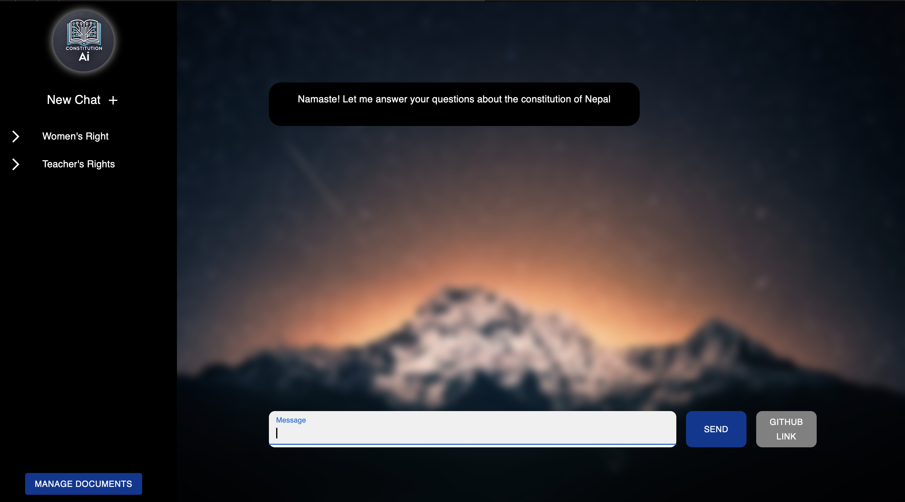

# Nepal Constitution AI 🇳🇵📜

**Nepal Constitution AI** is a Retrieval-Augmented Generation (RAG)-based chatbot designed to empower Nepalese citizens with legal knowledge. This project combines cutting-edge AI technology with a mission to address misinformation and improve access to constitutional rights in Nepal. By limiting the AI's knowledge space to official constitutional documents, it ensures accurate and reliable information delivery.


---

## 🌟 Background and Motivation

Nepal Constitution AI was developed following my participation in the Headstarter fellowship, where I explored various domains of AI implementation, including Retrieval-Augmented Generation (RAG) models and building impactful SaaS applications. 

### Why This Project?

Coming from Nepal, I have personally experienced and witnessed the challenges posed by limited legal education. Many citizens, including myself, have fallen victim to scams and misinformation, such as overcharging for registrations or licenses. This inspired me to create a solution that helps citizens:
- Cross-check the laws of Nepal.
- Learn about their rights in an accessible and user-friendly way.
- Avoid falling prey to scams by providing instant access to reliable legal information.

This project focuses on addressing these challenges by leveraging RAG models to minimize hallucinations and ensure that the AI assistant only provides information from verified constitutional documents.

---

## 🚀 Features

- **AI-Powered Q&A**: Provides accurate and structured answers based on Nepal's Constitution.
- **Domain-Specific Knowledge**: Limits AI knowledge to curated legal documents to reduce misinformation.
- **RAG Implementation**: Combines Llama3 with Pinecone for context-aware responses.
- **Session Management**: Tracks user conversations with Firebase for a seamless user experience.
- **Document Uploads**: Add new legal texts to the knowledge base dynamically.

---

## 🛠️ How It Works

1. **Knowledge Representation**:
   - The Constitution of Nepal and other legal documents are vectorized using OpenAI embeddings.
   - The embeddings are stored in Pinecone, a vector database, to allow for fast and relevant retrieval.

2. **Query Process**:
   - When a user asks a question, the system queries Pinecone for the most relevant document blocks.
   - These blocks are passed as context to Llama3 via OpenRouter.

3. **Response Generation**:
   - Llama3 generates an AI response based on the retrieved context and the user’s query.
   - The response is formatted and presented to the user in an easily readable format.

4. **Session Tracking**:
   - Firebase is used to store chat session data, enabling users to revisit previous conversations.

---

## 🏗️ Technology Stack

- **Frontend**: [Next.js](https://nextjs.org/) and [Material-UI](https://mui.com/)
- **Backend**: [Firebase Firestore](https://firebase.google.com/products/firestore) and [Next.js API Routes](https://nextjs.org/docs/api-routes/introduction)
- **AI Model**: [Llama 3](https://openrouter.ai/) via OpenRouter
- **Database**: [Pinecone](https://www.pinecone.io/) Vector Database
- **Hosting**: [Vercel](https://vercel.com/)

---

## 🏗️ Installation and Setup

### Prerequisites

- Node.js (>=14.x)
- Firebase account and Firestore configured
- Pinecone account and index created
- OpenRouter API key for Llama 3

### Steps

1. **Clone the Repository**:
   ```bash
   git clone https://github.com/akgupta2002D/customer_support_ai.git
   cd customer_support_ai
   ```

2. **Install Dependencies**:
   ```bash
   npm install
   ```

3. **Configure Environment Variables**:
   Create a `.env.local` file in the project root with the following:
   ```env
   FIREBASE_API_KEY=<your-firebase-api-key>
   FIREBASE_PROJECT_ID=<your-firebase-project-id>
   OPENROUTER_API_KEY=<your-openrouter-api-key>
   PINECONE_API_KEY=<your-pinecone-api-key>
   PINECONE_INDEX_NAME=<your-pinecone-index-name>
   ```

4. **Run the Development Server**:
   ```bash
   npm run dev
   ```

5. **Deploy the Application** (Optional):
   Deploy using Vercel:
   ```bash
   npx vercel
   ```

---

## 📂 Project Structure

- **`/components`**: Reusable UI components (e.g., Sidebar, ChatInterface)
- **`/utils`**: Helper functions for AI, Pinecone, and Firebase operations.
- **`/app/api`**: Backend API routes for chat, document upload, and RAG queries.
- **`/public`**: Static assets like the logo and background images.

---

## 📈 Challenges and Solutions

### Challenges
- **Minimizing Hallucinations**: Ensuring the AI doesn't generate false information.
- **Domain-Specific Knowledge**: Restricting responses to Nepal's Constitution.
- **Maintaining Accessibility**: Creating an intuitive and responsive UI for diverse users.

### Solutions
- **RAG Implementation**: Limited knowledge space with Pinecone vector database.
- **Super Prompting**: Tailored prompts to enforce constitutional accuracy.
- **Feedback Loops**: Session management for user feedback and improvement.

---

## 👨‍💻 Author

- **Ankit Gupta**  
  Software Engineer and AI Enthusiast  
  This project was created during the Headstarter Fellowship to explore the intersection of AI and social impact.  

Feel free to reach out via [GitHub](https://github.com/akgupta2002D) for questions or collaboration opportunities.

---

## 🌟 Acknowledgments

- **Headstarter Fellowship**: For introducing RAG models and SaaS development.
- **OpenRouter & Pinecone**: For providing robust tools to build this project.

---